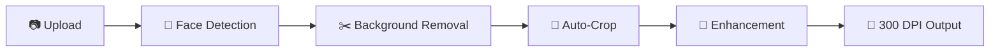

<a name="readme-top"></a>

<div align="center">


<br/>

# PhotoGen

### Your passport photo, done right. For free.

AI-powered face detection, background removal, and auto-cropping<br/>
for 10+ countries. No signup. No watermarks. No data stored.

<br/>

[](LICENSE)
[](https://python.org)
[](https://nextjs.org)
[](https://fastapi.tiangolo.com)

<br/>

[Demo](#demo) · [Features](#-features) · [Getting Started](#-getting-started) · [Supported Countries](#-supported-documents) · [Tech Stack](#-tech-stack) · [API](#-api) · [Deployment](#-deployment) · [License](#-license)

<br/>

</div>

## Demo

https://github.com/user-attachments/assets/564aa3e6-de8d-40bb-81aa-8ddfce3dc8fe

<br/>

## ✨ Features

<table>
<tr>
<td width="50%">

### AI Processing
- **Face Detection** via MediaPipe BlazeFace with Haar cascade fallback
- **Background Removal** using BiRefNet-portrait + alpha matting
- **Auto-Crop** to exact government specs (head %, eye position, dimensions)
- **Enhancement** with white balance + adaptive CLAHE contrast

</td>
<td width="50%">

### User Tools
- **Post-Processing** sliders for brightness, contrast, saturation
- **Manual Crop** with oval face template and alignment guides
- **Before / After** side-by-side comparison slider
- **Print Sheet** 4-up grid ready for photo center printing

</td>
</tr>
<tr>
<td width="50%">

### Output Quality
- **300 DPI** publication-quality JPEG export
- **Compliance Validation** for dimensions, head size, eye position, file size
- **10+ Country Specs** including US, EU, UK, Canada, Australia, India, China, Japan

</td>
<td width="50%">

### Zero Friction
- **Wide Format Support** for HEIC, AVIF, JPEG, PNG, WebP, BMP
- **100% Free** with no accounts or watermarks
- **Privacy First** with no data stored on server

</td>
</tr>
</table>

<br/>

## 🔄 Processing Pipeline



<br/>

## 🚀 Getting Started

### Prerequisites

| Requirement | Version |
|---|---|
| Python | 3.11+ |
| Node.js | 18+ |

### Backend

```bash
cd backend
python3 -m venv venv
source venv/bin/activate
pip install -r requirements.txt
uvicorn app.main:app --reload --port 8000
```

> The ML model (~170MB BiRefNet) downloads automatically on first request.

| | URL |
|---|---|
| API | http://localhost:8000 |
| Docs | http://localhost:8000/docs |

### Frontend

```bash
cd frontend
npm install
npm run dev
```

Open http://localhost:3000

<br/>

## 🌍 Supported Documents

| Document | Country | Size | Head Height | Background |
|---|---|---|---|---|
| US Passport | 🇺🇸 United States | 2x2" (600x600px) | 50-69% | White |
| US Visa | 🇺🇸 United States | 2x2" (600x600px) | 50-69% | White |
| EU Passport | 🇪🇺 EU / Schengen | 35x45mm (413x531px) | 70-80% | Light Gray |
| UK Passport | 🇬🇧 United Kingdom | 35x45mm (413x531px) | 70-80% | Light Gray |
| Canada Passport | 🇨🇦 Canada | 35x45mm (420x540px) | 71% | White |
| Australia Passport | 🇦🇺 Australia | 35x45mm (413x531px) | 75% | White |
| India Passport | 🇮🇳 India | 35x45mm (413x531px) | 75% | White |
| China Visa | 🇨🇳 China | 33x48mm (390x567px) | 70% | White |
| Japan Passport | 🇯🇵 Japan | 35x45mm (413x531px) | 70% | White |
| Germany Passport | 🇩🇪 Germany | 35x45mm (413x531px) | 75% | Light Gray |

<br/>

## 🛠 Tech Stack

<table>
<tr><th align="left">Backend</th><th align="left">Frontend</th></tr>
<tr>
<td valign="top">

| Library | Purpose |
|---|---|
| FastAPI + Uvicorn | API server |
| MediaPipe | Face detection |
| OpenCV | Haar cascade fallback |
| rembg (BiRefNet) | Background removal |
| PyMatting | Alpha matting |
| Pillow + pillow-heif | Image I/O |
| scikit-image | CLAHE enhancement |

</td>
<td valign="top">

| Library | Purpose |
|---|---|
| Next.js 16 + React 19 | App framework |
| TypeScript | Type safety |
| Tailwind CSS 4 | Styling |
| react-easy-crop | Manual crop |
| Axios | HTTP client |

</td>
</tr>
</table>

<br/>

## 📡 API

| Method | Endpoint | Description |
|---|---|---|
| `POST` | `/api/process` | Full processing pipeline |
| `POST` | `/api/detect-face` | Face detection only |
| `POST` | `/api/remove-background` | Background removal only |
| `GET` | `/api/requirements` | All country photo specs |
| `GET` | `/api/requirements/{code}` | Single country spec |
| `GET` | `/api/health` | Health check |

<br/>

## 📁 Project Structure

<details>
<summary>Click to expand</summary>

```
photogen/
├── backend/
│   ├── app/
│   │   ├── api/routes/
│   │   ├── core/
│   │   ├── services/
│   │   ├── models/
│   │   └── data/
│   ├── Dockerfile
│   └── requirements.txt
├── frontend/
│   ├── app/
│   └── src/
│       ├── components/
│       ├── hooks/
│       ├── lib/
│       └── constants/
└── shared/
    └── photo_requirements.json
```

</details>

<br/>

## 🚢 Deployment

| Service | Platform | Notes |
|---|---|---|
| Frontend | [Vercel](https://vercel.com) | Edge CDN, auto-deploy from `main` |
| Backend | [HuggingFace Spaces](https://huggingface.co/spaces) | Docker, 16GB RAM, 2 vCPU |

The backend `Dockerfile` is configured for HuggingFace Spaces with pre-downloaded models.

<br/>

## 📄 License

[MIT](LICENSE)

<div align="right">

[](#readme-top)

</div>
